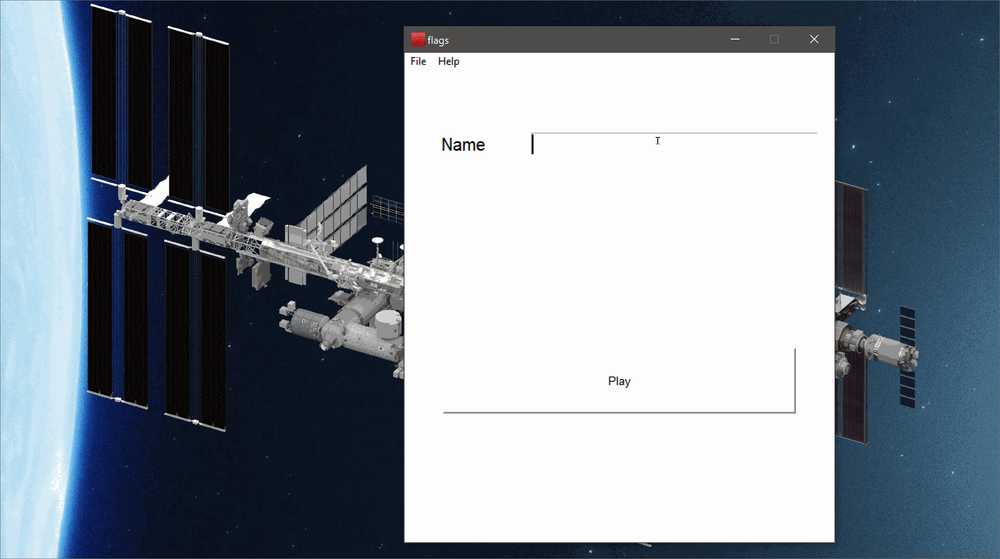

# flags
This repository belongs to flags game.

#####################################################

Used:
C:\Users\Ankur\Desktop\flags-master>autopep8 --in-place --aggressive --aggressive flags.py
#####################################################

Current pylint score with unnecessary suppressed warnings

C:\Users\Ankur\Desktop\flags-master>pylint --disable=C0103,W0108  flags.py
************* Module flags
flags.py:115:4: W0603: Using the global statement (global-statement)
flags.py:189:16: W0621: Redefining name 'button_one' from outer scope (line 97) (redefined-outer-name)
flags.py:189:28: W0621: Redefining name 'button_two' from outer scope (line 97) (redefined-outer-name)
flags.py:189:40: W0621: Redefining name 'button_three' from outer scope (line 97) (redefined-outer-name)
flags.py:189:54: W0621: Redefining name 'button_four' from outer scope (line 97) (redefined-outer-name)
flags.py:206:4: W0602: Using global for 'canvas' but no assignment is done (global-variable-not-assigned)
flags.py:255:4: W0602: Using global for 'userscore_canvas' but no assignment is done (global-variable-not-assigned)
flags.py:256:4: W0602: Using global for 'button_one' but no assignment is done (global-variable-not-assigned)
flags.py:256:4: W0602: Using global for 'button_two' but no assignment is done (global-variable-not-assigned)
flags.py:256:4: W0602: Using global for 'button_three' but no assignment is done (global-variable-not-assigned)
flags.py:256:4: W0602: Using global for 'button_four' but no assignment is done (global-variable-not-assigned)
flags.py:296:4: W0621: Redefining name 'canvas' from outer scope (line 31) (redefined-outer-name)
flags.py:396:8: W0603: Using the global statement (global-statement)
flags.py:397:8: W0603: Using the global statement (global-statement)
flags.py:567:31: W0613: Unused argument 'controller' (unused-argument)

------------------------------------------------------------------
Your code has been rated at 9.28/10 (previous run: 9.28/10, +0.00)

C:\Users\Ankur\Desktop\flags-master>

#####################################################

References:
https://en.wikipedia.org
https://python.hotexamples.com/examples/tkinter/Canvas/create_text/python-canvas-create_text-method-examples.html
https://likegeeks.com/python-gui-examples-tkinter-tutorial/
https://watermarkly.com/photo-resizer/
https://pypi.org/project/autopep8/#installation
https://stackhowto.com/how-to-disable-enable-tkinter-button-in-python/
#####################################################
